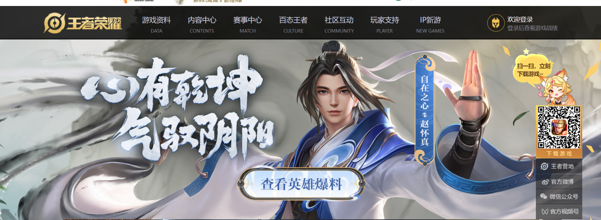

### 王者荣耀

#### 简介

《*王者荣耀*》是腾讯天美工作室推出的英雄竞技手游,不是一个人的王者,而是团队的荣耀!5v5王者峡谷PVP对战,领略英雄竞技的酣畅淋漓!丰富的游戏模式等你参与,体验突破传统、英雄竞技新形态!                    		

  用户可以点击链接进入[官网](https://pvp.qq.com/)

#### 玩法

王者荣耀中的玩法以竞技对战为主，玩家之间进行1V1、3V3、5V5等多种方式的[PVP](https://baike.baidu.com/item/PVP/11009824?fromModule=lemma_inlink)对战，在满足条件后可以参加游戏的[排位赛](https://baike.baidu.com/item/排位赛/18832028?fromModule=lemma_inlink)等，还可以参加[PVE](https://baike.baidu.com/item/PVE/3048830?fromModule=lemma_inlink)的闯关模式，是属于推塔类型的游戏。

《王者荣耀》游戏特色：

- 5v5！越塔强杀！超神！

  5V5经典地图，三路推塔，呈现最原汁原味的对战体验。英雄策略搭配，组建最强阵容，默契配合极限666！

- 深渊大乱斗！随机英雄一路团战！

  5V5大乱斗，即刻激情团战！随机盲选英雄，全团杀中路，冲突一触即发！一条路，全神装，血战到底！

- 随时开团！

  最适合手机的MOBA游戏，10分钟享受极致竞技体验。打野迂回，手脑配合，一战到底！人多，速来！

- 公平竞技！好玩不坑拼实力！

  凭实力carry全场，靠技术决定胜负。不做养成，不设体力，还你最初的游戏乐趣！

- 指尖超神！风骚走位秀操作！

  微操改变战局！手速流？意识流？看我风骚走位，力压群雄，打出钻石操作！收割，连杀超神！

  

##### 对抗路

- 对抗路这个位置由于对线比较有意思，也就是和对手近身单挑，斗智斗勇，比较有趣，加上对抗路英雄的特点也非常鲜明，甚至有绝境看对抗路的说法，这个位置越来越受欢迎，有大量的玩家逐渐喜欢上这个位置。
- 而大家可能不知道，对抗路可以根据不同的英雄类型分为四种玩法四类英雄，事实上当你选择了某些英雄的时候，这一把游戏你该怎么玩就已经基本确定下来了，如果你不知道这一点的话，那么就是对这个位置的研究还不够深。

- 比如第一种就是坦边，坦边可以说是最简单的对抗路英雄，玩法也是最简单，因为坦克英雄在对线的时候几乎是没有什么压力的，只要以清理兵线和守塔为主的话，那么几乎不可能会出现被单吃的情况。
- 而坦边的玩法就是前期对线，中后期就跟团，一般则是跟着射手和法师一起在正面，甚至连兵线都不需要你去带，而是打野接管你带线的任务，自己就在正面找机会打先手或者保护后排就行，是比较简单的一类，但同时也比较看队友，特别是看输出位置。

- 第二种就是惩击边路，这种打法下的英雄有很多，几乎所有的战士，只要不是特别依赖某个召唤师技能的话，基本上都是可以带惩击去改变自身的打法。
- 惩击边路的核心打法就是前期先清理兵线，不和对手线上纠缠，而是快速清理完兵线之后就入侵对面的野区，俗称偷野怪，可能从前期的小野怪开始，到后面只要看到对面的打野在另一边，半边野区都能快速刷完，甚至还能单挑龙，这就是惩击边路的打法。
- 好处就是自己能够快速发育起来，同时还能限制对面打野的发育，当自己刷起来以后，发育比对线的对手好，就可以轻松打穿一路了，缺点就是前期弱，前期要避战，尽量以刷为主。

- 第三种就是边核，听过射核野核和法核，但是很少会听到边核，因为射手和法师本就是输出位置，作为核心很正常，打野又几乎都是以纯输出为主，野核也很正常，但是对抗路起步都是战士，所以核心就比较少。
- 但是像马超这种英雄就可以当成核心来玩，打法就是不要脸地发育，自己对抗路的兵线还不够，甚至还有自家野区的小野怪，中路的兵线等，就是像其它核心一样先以发育为主，然后中后期站出来打伤害，这就是边路的核心。

- 代表英雄就有老夫子，程咬金，芈月，暗信等英雄，这些英雄在很多时候你甚至都可以不参团，并且发育起来的情况下，单挑是非常强大的，如果对手想抓自己，没几个人都抓不到，可以打出很好的牵制效果。
- 不过要记住，如果有比较大的优势，就没有必要一直单机带线了，适度去参团能更快帮助队友获得游戏的胜利。

- 但实际上对抗路真正的强者，真正可以久经不衰的英雄，是那些可以有多种打法的英雄，比如吕布这个英雄就一直都是热门对抗路英雄，大家知道为什么吗？
- 其实就是因为吕布既可以当成前排，也就是坦边来玩，吕布又可以当成输出核心来玩，甚至还有带惩击的玩法等，所以吕布才能一直热门，而不是大家看上去的英雄技能难度低，所以热门。
- 因为这样的英雄不管版本怎么变，不管赛季怎么更新，都会有他的一席之地，像之前黄刀流吕布的崛起，到现在闪现输出流吕布，你会发现什么版本这个英雄都能驾驭得住，这才是他久经不衰的原因。

##### 发育路

发育路一听这个名字，相信大家就已经感受到，这条路就是注重发育的一条路。按理来说，王者峡谷的每个英雄都注重发育，但是有的位置英雄如果发育起来了之后，在团队中的发育就显得尤为重要，这就是我们今天要和大家谈到的，发育路射手玩法。

为什么要说射手注重发育呢？因为射手是队伍中后期稳定的输出来源，前期身板很脆，血量很低，伤害也不高。而射手有区别的法师在前期伤害就比较高，有的法师比如安琪拉，王昭君达到4级就可以直接秒人了。法师是高爆发高伤害的存在，一套技能就可以带走人。

而射手的定位则是不一样的，射手是可以进行持续输出的，因为法师放完技能还需要等技能cd，而射手攻速起来之后的伤害是持续性、爆炸性的，而一个发育良好的射手，在团队保护好的情况下，是可以决定比赛的胜利的。

正是因为射手的这个属性，所以辅助的作用就更明显的了，一个发育良好的ad，是很容易成为敌人集火的目标，所以射手都需要辅助来保护。一般情况下辅助都是跟着中路法师去中路卡个视野，保护野区不被对面反野，看看对面打野是红开还是蓝开，有时间的话还可以一起把河蟹打了，这样就有机会去对面野区反野了。

当辅助前期的工作都做完了之后，就会有时间来下路，因为这个时候对面的打野到了4级就会下来抓人了，一般都会选择抓射手，这里不得不说一句射手好惨，从前期一直被抓到后期。

所以射手前期就是猥琐发育，可以看到我方打野差不多刷完野区，也就是对面打野刷完野区后，这个时候应该在3级左右，比对面的打野等级低一点，加上本身也非常弱，就算有辅助保护，还是要做到谨慎。

下路边上有两个草丛，对面打野如果来抓人的话，一般都会选择从草丛里过来，所以尽量离草丛远一点。而如果辅助在线上的话，也尽量要去这里卡视野，作为射手要做的就是靠近围墙，或者躲在围墙边上的草丛。

对面打野来抓人的话，大多数情况中路也会跟着过来，这样就可以做到确保击杀，因为4打2取胜的几率非常大，所以在3级的时候就需要做好保护措施了，如果辅助不在的话，尽量不要出塔，等兵线进塔在进行补兵，这样的话是比较稳妥的。

在射手在后期发育起来之后，装备也逐渐成型，加上辅助良好的保护，这样就可以作为一个稳定的输出点，对于最后的胜利有了很大的保障。

##### 打野

王者荣耀打野是指主要游走在野区打野升级，王者荣耀中打野的角色一般是由刺客来承担，打野发育比较快，需要一定的操作难度。

王者荣耀打野是什么意思?

打野就是指主要游走在野区打野升级，王者荣耀中打野的角色一般是由刺客来承担，打野发育比较快，需要一定的操作难度。

以野区资源为经验和经济获取的主要方式，采用刷野和反野、线上gank和反gank、参与团战等方式，达到减少对方或增加己方团队收益目的的非线上位置。打野也叫做：Jungle。

王者荣耀常见的打野英雄有孙悟空、李白、娜可露露、阿珂、典韦、韩信等。

##### 中路

在王者荣耀中饭，中路是指水晶所出兵线在地图中走的最中间的路线；

中路的英雄为中单。

中路英雄一般选AP，即魔法伤害输出类英雄，大多数为远程，攻击距离较远的英雄。

##### 辅助

在王者荣耀中，一般来说，辅助都是站在输出前面的，用来抗伤害，即使是比较脆的辅助，也得尽量自己死也不能让输出死。但有些辅助却天生喜欢站输出的后面，即使有一开始在前面的，在游戏中打着打着也会跑到输出后面去，手不能提肩不能抗的一副柔弱的样子。

1、明世隐：明世隐作为射手的第七件神装，他通常都是站在射手的后面的，他身板比较脆，还没有射手的吸血能力，如果用来抗的话，通常都要比射手先死，先死的明世隐，射手没了输出加成，也没了保命的瞬间回血能力，就很难立足。虽说明世隐有个普攻三下能晕人的技能，但明世隐一般也不能上去普攻，所以这个技能就显得比较鸡肋，建议改一下。

2、孙膑：孙膑有个抬血的二技能，用完这个技能后，队友和自己都会走得飞快。玩孙膑就喜欢疯狂调戏敌人，给他们扔一技能，如果敌人要追过来，就立马开二技能逃跑，所以玩孙膑的玩家都跑得飞快，有时候甚至队友刚冲上去，孙膑已经开二技能跑离战场了。 因为孙膑跑得快，所以他特别喜欢在团战的边缘地带疯狂游走，根本不可能上前扛伤害的。

3、瑶：瑶也是不能上前抗的，瑶要么在队友头上，被打下来要赶紧跑，自身的身板根本扛不住对面的伤害，用一技能把敌人弹走，如果被控了那更是太好了，可以化身小鹿轻易逃脱。 当然了，有些好的瑶会变成小鹿后立马变成人形继续回到输出头上，但命运是一起死还是一起活就不知道了，没了被动的瑶还是很轻易被打死的。

4、大乔：大乔也是一个喜欢躲队友后面的辅助，因为大乔的攻击还都是远距离的，让她上前抗的意义不大，还有可能先死，失去了坐电梯的机会。大乔的沉默技能在团战中还是挺恶心的，本来打的好好的，一个沉默就可能让自己错失良机。